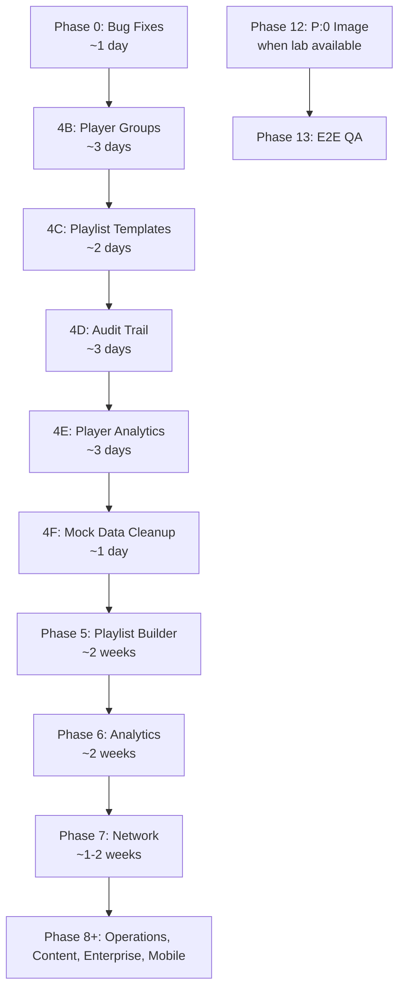

# ODS Digital Signage — Consolidated Roadmap
**Date:** 2026-02-27 (restored + updated)  
**Sources:** [roadmap.md](file:///Users/robert.leejones/.gemini/antigravity/brain/07d7b3a2-e44c-4ab4-9e03-72cb991097bc/roadmap.md), [beta_state_push_plan.md](file:///Users/robert.leejones/.gemini/antigravity/brain/07d7b3a2-e44c-4ab4-9e03-72cb991097bc/beta_state_push_plan.md), [ods_cloud_audit_report.md](file:///Users/robert.leejones/.gemini/antigravity/brain/f2dab886-d100-4769-91ce-bf89e8a1dba9/ods_cloud_audit_report.md)

---

## Status Overview

| Phase | Name | Status |
|-------|------|--------|
| 1-3 | Core Infrastructure, UI, Dashboard, Players, Content, Playlists | ✅ Complete |
| 0 | Critical Bug Fixes | ✅ Complete (8/8) |
| 4A | RBAC & Multi-Tenancy | ✅ Complete |
| 4B | Player Groups | ✅ Complete (already built) |
| 4C | Playlist Templates | ✅ Complete (already built) |
| 4D | Audit Trail | ✅ Complete (already built) |
| 4E | Player Analytics | ✅ Complete (already built) |
| 4F | Mock Data Cleanup | ✅ Complete |
| 4G | **Player Content Renderer** *(NEW)* | ✅ Complete |
| 4H | **Device Config API** *(NEW)* | ✅ Complete |
| 5 | Advanced Playlist Builder | ⬜ Not started |
| 6 | Analytics Dashboard | ⬜ Not started |
| 7 | Network Monitoring | ⬜ Not started |
| 8 | Operations & Maintenance | ⬜ Not started |
| 9 | Content Creation Tools | ⬜ Not started |
| 10 | Enterprise Features | ⬜ Not started |
| 11 | Mobile & Remote Access | ⬜ Not started |
| 12 | **Build P:0 Golden Image** *(NEW)* | ⬜ Blocked (lab access) |
| 13 | **End-to-End Integration & QA** *(NEW)* | ⬜ Not started |

### ODS Player OS (Atlas)
- ✅ Golden image build pipeline (v9-2-1)
- ✅ QR code → WiFi AP → captive portal → setup.html
- ✅ QR code → ODS Cloud deep link → player pairing
- ✅ System config with signage-friendly UI
- ✅ 3-state network indicators + default network toggle
- ✅ Blended Stitch UI design (network_setup + player_link)
- ✅ WiFi fix (wpa_supplicant headers + sudoers)
- ✅ Chromium cache-busting flags
- ✅ `player.html` — post-pairing content renderer
- ⬜ Missing: `POST /api/players/:id/unpair` on ODS Server

---

## 🔴 Phase 0: Critical Bug Fixes (~1 day)

Audit findings that must be fixed before any feature work. Live bugs visible to users.

| # | Bug | File | Fix | Status |
|---|-----|------|-----|--------|
| 1 | **NaN MB** on content cards | `network/page.tsx:L528` | Null-safe size + metadata fallback | ✅ |
| 2 | **Hardcoded "0:15" duration** on all videos | `network/page.tsx:L538` | Read actual duration from metadata | ✅ |
| 3 | **Mock warnings/syncs** in Network page | `network/page.tsx:L73-75` | Real status-based filters | ✅ |
| 4 | **Console.log debug statements** in 3 files | `login`, `players`, `content` | Removed (kept console.error) | ✅ |
| 5 | **"View All" button** — no action | `analytics/page.tsx:L373` | Wired to /content via Link | ✅ |
| 6 | **"More" (⋮) button** — no dropdown | `analytics/page.tsx:L618` | Replaced with playlist link | ✅ |
| 7 | **Folder filter disabled** | `AddContentModal.tsx:L50` | Removed tab | ✅ |
| 8 | **Missing unpair endpoint** | ODS Server | Added POST /api/players/:id/unpair | ✅ |

---

## 🟡 Phase 4: Beta State Push (~2-3 weeks)

> Full spec: [beta_state_push_plan.md](file:///Users/robert.leejones/.gemini/antigravity/brain/07d7b3a2-e44c-4ab4-9e03-72cb991097bc/beta_state_push_plan.md) (35KB)

### 4A: RBAC & Multi-Tenancy ✅ Complete
- ✅ 7-role system (system, owner, manager, viewer, integrations, odsadmin, odstech)
- ✅ Supabase custom_access_token_hook for JWT custom claims
- ✅ ODSAdmin/ODSTech "View As" mode switching
- ✅ Multi-tenant org isolation via `effective_organization_id`
- ✅ Pairing `account_id` alignment fix (Cloud → Server)

### 4B: Player Groups ✅ Complete (Already Built)
- ✅ Sidebar navigation (matches Content Library pattern)
- ✅ Create/rename/delete groups
- ✅ Drag player → group assignment
- ✅ Group-based playlist deployment (DeployPlaylistModal)
- ✅ Bulk assign players to groups
- ✅ Context menu (rename, delete, deploy)
- ✅ `PlayerGroupTree` component + `GroupContextMenu`

### 4C: Playlist Templates
- Template sidebar on Playlists page
- Save playlist as template
- Create from template
- ODS-provided templates (public)
- New table: `playlist_templates`

### 4D: Audit Trail
- Automatic logging middleware for all mutations
- Enhanced Operations page with "View All" modal
- Filters: user, action, resource type, date range
- Export: CSV, PDF, compliance report
- New table: `audit_logs`

### 4E: Player Analytics
- Uptime chart (Chart.js bar chart, 30-day)
- Offline incidents timeline
- Geographic distribution map (Leaflet.js)
- Replace ALL mock data in Analytics page with real API
- New table: `player_analytics`

### 4F: Analytics Mock Data Cleanup
- Remove `Math.random()` generators from analytics
- Remove fabricated impressions, trend percentages, engagement scores
- Replace with real data from `player_analytics` table
- Wire up activity chart with real Chart.js data

### 4G: Player Content Renderer ✅ Complete *(NEW)*
- ✅ [player.html](file:///Users/robert.leejones/Documents/GitHub/ods-player-atlas/public/player.html) — slideshow with image/video, crossfade
- ✅ WebSocket register/heartbeat/deploy_playlist
- ✅ Config poll every 30s with SHA-256 hash check
- ✅ Progress bar, status pill, keyboard lockdown
- ✅ "Paired & Ready" waiting state

### 4H: Device Config API ✅ Complete *(NEW)*
- ✅ [device-config.js](file:///Users/robert.leejones/Documents/GitHub/ods-server-archaeopteryx/routes/device-config.js) — 3 public endpoints
- ✅ `GET /api/device/config/:device_uuid` — full config (no JWT)
- ✅ `GET /api/device/config/hash/:device_uuid` — hash check
- ✅ `GET /api/device/content/:id/stream` — content streaming
- ✅ Deployed to `api.ods-cloud.com`

---

## 🔵 Phase 5: Advanced Playlist Builder (~2 weeks)

- Time-based scheduling (day-of-week, date range, priority)
- Holiday/special event scheduling
- Transition effects (fade, slide, zoom) with duration config
- Multi-zone layouts (split screen, PiP, ticker/banner)
- Weather widget and RSS feed zones

---

## 🔵 Phase 6: Analytics Dashboard (~2 weeks)

- Content play count tracking and reports
- Most/least played content
- Playlist deployment history and completion rates
- Custom report builder with scheduled generation
- Export to PDF/Excel with email delivery
- A/B testing for playlists

---

## 🔵 Phase 7: Network Monitoring (~1-2 weeks)

- Real-time network topology visualization
- Bandwidth usage by player
- Connection quality indicators with latency monitoring
- Alert rules engine (offline, sync failure, storage, custom)
- Email/SMS notification integration
- Remote diagnostics (logs, ping, traceroute, restart)

---

## ⬜ Phase 8: Operations & Maintenance (~2 weeks)

- Firmware update management with rollback
- Automated database backups to cloud storage
- Configuration export/import
- User management with RBAC enforcement
- Complete audit trail with compliance reporting

---

## ⬜ Phase 9: Content Creation Tools (~2-3 weeks)

- Simple image editor (crop, resize, filters, text overlay)
- Template-based content creator with brand asset library
- Integrations: Canva, Google Drive, Dropbox, social media feeds
- Dynamic content: live data feeds, API-driven, QR generator, countdown timers

---

## ⬜ Phase 10: Enterprise Features (~3-4 weeks)

- Multi-tenancy (tenant isolation, branding, cross-tenant sharing)
- 2FA, SSO (SAML/OAuth), IP whitelisting
- Encrypted content delivery
- CDN integration, database clustering, load balancing

---

## ⬜ Phase 11: Mobile & Remote Access (~2-3 weeks)

- iOS/Android mobile app with push notifications
- Quick status check and emergency content push
- Web-based remote desktop to players
- Mobile-optimized dashboard (PWA)

---

## 🟠 Phase 12: Build P:0 Golden Image *(NEW)*

> Blocked on lab access (jdl-mini-box build server + dev Pi device)

- Update `atlas_firstboot.sh` with Chromium cache flags
- Include blended Stitch UI (network_setup + player_link)
- Include `player.html` content renderer
- WiFi configuration fix (wpa_supplicant headers + sudoers)
- Test: boot → network_setup → player_link → pairing → player.html
- Build server: `jdl-mini-box` (10.111.123.134) or Lima VM `atlas-build`

---

## 🟠 Phase 13: End-to-End Integration & QA *(NEW)*

- Full flow test: Player boots → WiFi → Pair → Content plays
- Dashboard pairs device → assigns playlist → player renders
- WebSocket real-time updates verified
- Offline/reconnect behavior validated
- Multi-player test (2+ devices paired to same org)

---

## Recommended Execution Order

> [!TIP]
> **Phases 4A, 4G, 4H are complete.** Phase 12 runs in parallel when lab access is available. Phase 0 bugs can be tackled alongside any feature work.

---

## Design Constraints (All Phases)

- Dark slate-950 theme with glass-card styling
- Material Icons for all iconography
- Real-time updates via WebSocket (Socket.IO)
- Mobile-responsive layouts
- RESTful API conventions
- Supabase RLS for all authorization
