# ODS Digital Signage — Consolidated Roadmap
**Date:** 2026-02-28 (v10-0-0-MANAGER update)  
**Sources:** [Previous Roadmap](file:///Users/robert.leejones/Documents/GitHub/ods-cloud-amigo/kbase/artifacts/archive/ods_consolidated_roadmap_2026-02-27.md), [Forensic Analysis](file:///Users/robert.leejones/.gemini/antigravity/brain/f2dab886-d100-4769-91ce-bf89e8a1dba9/forensic_analysis.md)

---

## Status Overview

| Phase | Name | Status |
|-------|------|--------|
| 0 | Critical Bug Fixes | ✅ Complete (8/8) |
| 1-3 | Core Infrastructure, UI, Dashboard, Players, Content, Playlists | ✅ Complete |
| 4A | RBAC & Multi-Tenancy | ✅ Complete |
| 4B | Player Groups | ✅ Complete |
| 4C | Playlist Templates | ✅ Complete |
| 4D | Audit Trail | ✅ Complete |
| 4E | Player Analytics | ✅ Complete |
| 4F | Mock Data Cleanup | ✅ Complete |
| 4G | Player Content Manager | ✅ Complete (v10 — `player_content_manager.html`) |
| 4H | Device Config API | ✅ Complete |
| 4I | **Player OS v10 Hardening** | ✅ Complete |
| **5** | **Build v10-0-1-MANAGER P:0** | **✅ Complete (1.8G golden + 4.5G clone)** |
| **6** | **🔥 ODS Cloud v10 Alignment** | **⬜ NEXT** |
| 7 | **ODS Server v10 Enhancements** *(NEW)* | ⬜ Not started |
| 8 | **Supabase Schema & RLS Updates** *(NEW)* | ⬜ Not started |
| 9 | Advanced Playlist Builder | ⬜ Not started |
| 10 | Analytics Dashboard | ⬜ Not started |
| 11 | Network Monitoring | ⬜ Not started |
| 12-14 | Operations, Content Tools, Enterprise | ⬜ Not started |
| 15 | End-to-End Integration & QA | ⬜ Not started |
| 16 | **Mobile App** *(NEW)* | ⬜ Not started |


### ODS Player OS (Atlas) — v10-0-0-MANAGER ✅
- ✅ `player_content_manager.html` — full-screen slideshow + socket.io deploy push
- ✅ `player_status.html` (renamed from `player_ready.html`) — status lobby + redirect
- ✅ `player_registration.html` (renamed from `enrolling.html`)
- ✅ All keyboard shortcuts (I=Info, K=Kill, O=Options, B=Border debug)
- ✅ **Offline Border Template System** (full sprint):
  - 6 templates with 4-stage color escalation (0–30m / 30–60m / 60–120m / 120m+)
  - 5 unique Stage 4 animations: Marching Ants, Breathing Glow, Heartbeat, Conic Rotation, Synchronous Blink
  - 3px inset border, `pointer-events: none`, GPU-accelerated (`will-change`)
  - Activates on WS disconnect, clears instantly on reconnect
  - Reads `offline_border.template` from device config (org-level setting, defaults to Template 0)
  - `custom_colors` hook wired and ready for ODS Cloud > Settings > Organization UI
  - Debug shortcut: `Ctrl+Alt+Shift+B` — cycles templates at 60× speed (1 hour per minute)
  - ⚠️ **Fix applied:** `0.450px` sub-pixel width wasn't rendering — updated to `1px` (Micro)
- ✅ Cache manager + cloud-sync
- ✅ Kill shortcut with webserver restart (sudoers configured)
- ✅ Stale slideshow code removed from status page
- ✅ Duplicate `player-config.js` removed from ODS Server
- ✅ Version files created (v8-0-FLASH, v8-3-PLAYER, v9-0-ORIGIN, v10-0-MANAGER)

---

## 🔥 Phase 5: Build v10-0-0-MANAGER P:0 — NEXT

> **In-lab on jdl-mini-box** — no longer blocked

```bash
sudo -A bash scripts/inject_atlas.sh \
  ~/atlas-build/Armbian_26.2.1_Rpi4b_trixie_current_6.18.9_minimal.img \
  ~/atlas-build/ods-atlas-golden-v10-0-0-MANAGER.img
```

**Checklist:**
- [ ] Run `inject_atlas.sh` on jdl-mini-box
- [ ] Flash to SD card
- [ ] Verify firstboot completes (11 steps)
- [ ] Verify page flow: `network_setup` → `player_link` → `player_status` → `player_content_manager`
- [ ] Verify socket.io deploy push from ODS Cloud
- [ ] Verify kill shortcut (Ctrl+Alt+Shift+K)
- [ ] Clone P:1 safety net via `partclone`
- [ ] Shrink + DD for Etcher-ready image
- [ ] Archive to `/Volumes/NVME_VAULT/golden-atlas-img/`

---

##  Phase 6: ODS Cloud v10 Alignment *(NEW — ~1 week)*

Align the ODS Cloud dashboard with v10 player OS changes.

| Item | Detail |
|------|--------|
| **Page name awareness** | Dashboard references updated: `player_status` replaces `player_ready`, `player_registration` replaces `enrolling` |
| **Content Manager status** | Players page shows whether device is on status lobby vs content manager |
| **Deploy push indicator** | After playlist deploy, show real-time confirmation via socket.io ack |
| **Wallpaper management** | Upload org wallpaper → pushed to player via config → glass card background |
| **Cache status visibility** | Players page shows cached asset count and last sync timestamp |
| **Player name/account display** | Ensure player status page gets Account/Device name from config |

### 6A: Offline Border Management UI *(Critical — completes player-side hook)*

The player already reads `offline_border.template` and `offline_border.custom_colors` from the device config. This phase builds the org-level configuration UI in ODS Cloud.

| Item | Detail |
|------|--------|
| **Template Picker** | Settings > Organization page — visual grid/carousel of all 6 templates with preview swatches showing their 4-stage color progression |
| **Template Preview** | Each template shows: name, color stages (4 dots), Stage 4 animation type (label + icon) |
| **Custom Colors** | When selected, allow `[hex1, hex2, hex3, hex4]` override per stage — color picker for each |
| **Live Preview** | Optional: animated border preview in the settings panel showing the selected template's Stage 4 animation |
| **Save → Push** | On save, update org record → next device config poll picks up new template index + custom colors |
| **Per-Player Override** | Future: allow per-player template override (player-level setting overrides org default) |

**Border Size Presets (Org-level setting):**

| Preset | Size | Use Case |
|--------|------|----------|
| Micro | 1px | Subtle indicator, minimal visual interruption |
| Mini | 2px | Light visibility |
| Medium | 3px | Clearly visible without being distracting |
| Major | 4px | Higher visibility for managed deployments |
| Mega | 5px | Very visible — operations/monitoring priority |
| Mammoth | 6px | Maximum visibility — critical alerting environments |

> Default: **Micro (1px)**. UI: dropdown or segmented control on Settings > Organization page.

**Template Reference (built on player):**

| # | Name | Stage 1 (0-30m) | Stage 2 (30-60m) | Stage 3 (60-120m) | Stage 4 (120m+) | Animation |
|---|------|-----------------|------------------|-------------------|-----------------|-----------|
| 0 | Standard Logic | `#FFFF00` | `#FFA500` | `#FF0000` | `#FF0000` | Marching Ants |
| 1 | Minimal & Neutral | `#F2D2BD` | `#CC7722` | `#361010` | `#000000` | Synchronous Blink |
| 2 | Tokyo Night | `#24283b` | `#e0af68` | `#f7768e` | `#f7768e` | Breathing Glow |
| 3 | Catppuccin | `#f5e0dc` | `#fab387` | `#eba0ac` | `#eba0ac` | Conic Rotation |
| 4 | Monokai Pro | `#a9dc76` | `#fc9867` | `#ff6188` | `#ff6188` | Marching Ants |
| 5 | Natural & Calm | `#87a980` | `#d2b48c` | `#e2725b` | `#e2725b` | Heartbeat |

---

## 🟠 Phase 7: ODS Server v10 Enhancements *(NEW — ~1 week)*

| Item | Detail |
|------|--------|
| **Config enrichment** | `device-config.js` `buildConfig()` → add player name, account name fields |
| **Deploy push ack** | When player receives `deploy_playlist`, emit `deploy_ack` back → server relays to Cloud |
| **Content stream optimization** | Consider signed Google Drive URLs for direct player download (skip server proxy) |
| **Enrollment info endpoint** | New `GET /api/device/enrollment/:uuid` → returns `{ account_name, device_name }` |
| **Player sync status tracking** | Store sync result in Supabase when player reports `sync_status` event |
| **Supabase real-time** | Evaluate `subscribeToChanges()` (currently unused) for instant config push |
| **Hardcoded URL elimination** | Server-side config should provide `api_url` so player pages don't hardcode it |

### 7A: Offline Border Config Pipeline

Connect the ODS Cloud org-level settings to the player via device config.

| Item | Detail |
|------|--------|
| **Org border read** | `buildConfig()` reads `offline_border_template` + `offline_border_custom_colors` from org record in Supabase |
| **Config schema** | `offline_border: { enabled, width, template (0-5), custom_colors ([hex1,hex2,hex3,hex4] or null) }` — already wired in `device-config.js` |
| **Width from org** | `buildConfig()` reads `offline_border_width` from org record → maps preset name to px value |
| **Validation** | Template index must be 0-5, custom_colors must be valid hex array or null, width must be 1-6 |
| **Config hash impact** | Border config changes trigger hash change → player polls → picks up new template instantly |

---

## 🟠 Phase 8: Supabase Schema & RLS Updates *(NEW — ~3 days)*

| Item | Detail |
|------|--------|
| **Player cache status** | New columns: `cache_asset_count`, `cache_last_sync`, `cache_config_hash` |
| **Player page state** | New column: `current_page` (status/content_manager/options) |
| **Wallpaper storage** | Org-level: `wallpaper_url` (Supabase Storage bucket) |
| **Deploy acknowledgments** | New table or column: `last_deploy_ack`, `last_deploy_timestamp` |
| **RLS policies** | Verify all new columns/tables respect org isolation |
| **Migration files** | Create versioned migration files for all schema changes |

### 8A: Offline Border Schema (Organizations table)

| Column | Type | Default | Notes |
|--------|------|---------|-------|
| `offline_border_template` | `integer` | `0` | Template index (0-5), references built-in template set |
| `offline_border_custom_colors` | `jsonb` | `null` | `["#hex1", "#hex2", "#hex3", "#hex4"]` — overrides template stage colors when set |
| `offline_border_enabled` | `boolean` | `true` | Master toggle — allows org to disable border entirely |
| `offline_border_width` | `text` | `micro` | Preset name: micro/mini/medium/major/mega/mammoth (maps to 1-6px) |

**RLS:** Org members can read, only `owner`/`manager`+ can write. ODS Staff can read/write any org.

---

## 🔵 Phase 9-14: Feature Roadmap

| Phase | Name | Est. |
|-------|------|------|
| 9 | Advanced Playlist Builder (scheduling, transitions, multi-zone) | ~2 weeks |
| 10 | Analytics Dashboard (play counts, reports, A/B testing) | ~2 weeks |
| 11 | Network Monitoring (topology, bandwidth, alerting) | ~1-2 weeks |
| 12 | Operations & Maintenance (firmware, backups, config export) | ~2 weeks |
| 13 | Content Creation Tools (editor, templates, integrations) | ~2-3 weeks |
| 14 | Enterprise Features (SSO, CDN, clustering) | ~3-4 weeks |

---

## 🟡 Phase 15: End-to-End Integration & QA (~2 days)

- Full flow: Player boots → WiFi setup → Pair → Content plays
- ODS Cloud: pair device → assign playlist → player renders immediately (deploy push)
- WebSocket real-time verify: deploy_playlist event reaches content manager
- Offline/reconnect: border activates → reconnect → border clears → content resumes
- Cached content: unplug network → reboot → "Loading cache..." → cached slideshow plays
- Multi-player: 2+ devices paired to same org
- Keyboard shortcuts from both pages

---

## ⬜ Phase 16: Mobile App *(NEW)*

- iOS/Android mobile app with push notifications
- Quick status check and emergency content push
- Mobile-optimized dashboard (PWA)
- Web-based remote player access

---

## Execution Order

```mermaid
graph TD
    P5[🔥 Phase 5: P:0 Image Build<br/>NOW] --> P6[Phase 6: Cloud Alignment<br/>~1 week]
    P6 --> P7[Phase 7: Server Enhancements<br/>~1 week]
    P7 --> P8[Phase 8: Supabase Schema<br/>~3 days]
    P8 --> P9[Phase 9-14: Feature Phases]
    P9 --> P15[Phase 15: E2E QA<br/>~2 days]
    P15 --> P16[Phase 16: Mobile App]
```



---

## Design Constraints (All Phases)

- Dark slate-950 theme with glass-card styling
- Material Icons for all iconography
- Real-time updates via WebSocket (Socket.IO)
- Mobile-responsive layouts
- RESTful API conventions
- Supabase RLS for all authorization
