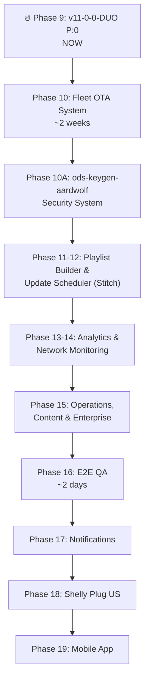

# ODS Digital Signage — Consolidated Roadmap
**Date:** 2026-03-06 (v11-0-0-DUO update)  
**Sources:** [Previous Roadmap](file:///Users/robert.leejones/Documents/GitHub/ods-cloud-amigo/kbase/artifacts/archive/ods_consolidated_roadmap_2026-02-28.md), [Fleet OTA Implementation Plan](file:///Users/robert.leejones/Documents/GitHub/ods-cloud-amigo/kbase/artifacts/archive/implementation_plan.md.resolved)

---

## Status Overview

| Phase | Name | Status |
|-------|------|--------|
| 0 | Critical Bug Fixes | ✅ Complete (8/8) |
| 1-3 | Core Infrastructure, UI, Dashboard, Players, Content, Playlists | ✅ Complete |
| 4A | RBAC & Multi-Tenancy | ✅ Complete |
| 4B | Player Groups | ✅ Complete |
| 4C | Playlist Templates | ✅ Complete |
| 4D | Audit Trail | ✅ Complete |
| 4E | Player Analytics | ✅ Complete |
| 4F | Mock Data Cleanup | ✅ Complete |
| 4G | Player Content Manager | ✅ Complete (v10 — `player_content_manager.html`) |
| 4H | Device Config API | ✅ Complete |
| 4I | **Player OS v10 Hardening** | ✅ Complete |
| **5** | **Build v10-0-1-MANAGER P:0** | **✅ Complete (1.8G golden + 4.5G clone)** |
| **6** | **ODS Cloud v10 Alignment** | ✅ Complete |
| **7** | **ODS Server v10 Enhancements** | ✅ Complete |
| **8** | **Supabase Schema & RLS Updates** | ✅ Complete |
| **9** | **Build v11-0-0-DUO P:0** | **🔥 Next** |
| **10** | **Fleet OTA Update System** *(NEW)* | ⬜ Not started |
| **10A** | **ods-keygen-aardwolf Security System** *(NEW)* | ⬜ Not started |
| 11 | **Stitch Designed Advanced Playlist Builder/Editor** | ⬜ Not started |
| 12 | **Stitch Designed Advanced Operations Update Scheduler** | ⬜ Not started |
| 13 | Analytics Dashboard | ⬜ Not started |
| 14 | Network Monitoring | ⬜ Not started |
| 15 | Operations, Content Tools, Enterprise | ⬜ Not started |
| 16 | End-to-End Integration & QA | ⬜ Not started |
| 17 | **Notifications** | ⬜ Not started |
| 18 | **Shelly Plug US Integration** | ⬜ Not started |
| 19 | **Mobile App** | ⬜ Not started |


### ODS Player OS (Atlas) — v10-0-0-MANAGER ✅
- ✅ `player_content_manager.html` — full-screen slideshow + socket.io deploy push
- ✅ `player_status.html` (renamed from `player_ready.html`) — status lobby + redirect
- ✅ `player_registration.html` (renamed from `enrolling.html`)
- ✅ All keyboard shortcuts (I=Info, K=Kill, O=Options, B=Border debug)
- ✅ **Offline Border Template System** (full sprint):
  - 6 templates with 4-stage color escalation (0–30m / 30–60m / 60–120m / 120m+)
  - 5 unique Stage 4 animations: Marching Ants, Breathing Glow, Heartbeat, Conic Rotation, Synchronous Blink
  - 3px inset border, `pointer-events: none`, GPU-accelerated (`will-change`)
  - Activates on WS disconnect, clears instantly on reconnect
  - Reads `offline_border.template` from device config (org-level setting, defaults to Template 0)
  - `custom_colors` hook wired and ready for ODS Cloud > Settings > Organization UI
  - Debug shortcut: `Ctrl+Alt+Shift+B` — cycles templates at 60× speed (1 hour per minute)
  - ⚠️ **Fix applied:** `0.450px` sub-pixel width wasn't rendering — updated to `1px` (Micro)
- ✅ Cache manager + cloud-sync
- ✅ Kill shortcut with webserver restart (sudoers configured)
- ✅ Stale slideshow code removed from status page
- ✅ Duplicate `player-config.js` removed from ODS Server
- ✅ Version files created (v8-0-FLASH, v8-3-PLAYER, v9-0-ORIGIN, v10-0-MANAGER)

### v10 → v11 Transition (atlas_firstboot.sh Cleanup) ✅
- ✅ All heredoc blocks extracted to standalone files (21 new files)
- ✅ `deploy_services()` and `deploy_player_scripts()` rewritten to use `cp` from repo
- ✅ `atlas_firstboot.sh` reduced from 1541 → 1095 lines (-29%)
- ✅ Scripts, services, and configs are now independently OTA-updatable (Baked Script Trap eliminated)
- ✅ File organization: `scripts/` (4), `scripts/services/` (11), `config/` (6)
- ✅ Display layout matrix complete: single landscape, single portrait, dual landscape, dual portrait

---

## 🔥 Phase 9: Build v11-0-0-DUO P:0 — NEXT

> **Purpose:** Create a golden image that captures the v11-0-0-DUO baseline — the last version before the Fleet OTA system replaces git-pull-based updates. This image serves as the foundation image that all future OTA updates are applied on top of.

### What's New in v11-0-0-DUO vs v10-0-1-MANAGER
- ✅ Heredoc elimination — all scripts, services, and configs are standalone repo files
- ✅ `cp`-based deployment in firstboot (no more inline content generation)
- ✅ Display layout configs extracted to `config/layout/` (single landscape, single portrait, dual landscape, **dual portrait**)
- ✅ All systemd units in `scripts/services/` (ready for OTA replacement)

### Build Checklist
- [ ] Update `VERSION` file to `v11-0-0-DUO`
- [ ] Run `inject_atlas.sh` on jdl-mini-box with latest Armbian base
- [ ] Flash to SD card
- [ ] Verify firstboot completes (all steps)
- [ ] Verify page flow: `network_setup` → `player_link` → `player_status` → `player_content_manager`
- [ ] Verify socket.io deploy push from ODS Cloud
- [ ] Verify kill shortcut (Ctrl+Alt+Shift+K)
- [ ] Clone P:1 safety net via `partclone`
- [ ] Shrink + DD for Etcher-ready image
- [ ] Archive to `/Volumes/NVME_VAULT/golden-atlas-img/`

---

## Phase 10: Fleet OTA Update System *(NEW — ~2 weeks)*

> **Full implementation plan:** [implementation_plan.md](file:///Users/robert.leejones/Documents/GitHub/ods-cloud-amigo/kbase/artifacts/archive/implementation_plan.md.resolved)

Replace git-pull-based OTA with a Google Drive staging system. Updates are stored in versioned folders within `staged_updates/`. ODS operators assign target versions to devices via the dashboard. Devices download update files through the Archaeopteryx API (proxied from Google Drive). No SSH keys, no git credentials, no repo clones on devices.

| Component | Key Changes |
|-----------|-------------|
| **Server (Archaeopteryx)** | New `routes/staged-updates.js` (5 endpoints), `google-drive.js` extensions, `target_version` Supabase column |
| **Player (Atlas)** | Rewritten `ods-system-update.sh` (Drive-based download + checksum verification), `cloud-sync.js` auto-trigger |
| **Dashboard (Amigo)** | Version Manager section on Operations page (list versions, assign to devices, fleet distribution) |

### Google Drive Folder Structure
```
ODS_Content_Storage/
  staged_updates/                    (ID: 1RJDnpMnoUNCHP0H8Sw6B2g1hprmGGC2g)
    v11-0-0-DUO/
      manifest.json                  ← file list + sha256 checksums
      scripts/ | config/ | services/
    v11-0-1-PATCH/
      manifest.json
      ...
```

### Phase 10A: ods-keygen-aardwolf Security System *(NEW)*

> **Full architecture:** [ods_keygen_aardwolf_architecture.md](file:///Users/robert.leejones/Documents/GitHub/ods-keygen-aardwolf/ods_keygen_aardwolf_architecture.md)

Hardware-bound credential security for golden images. Eliminates plaintext secrets from disk using a USB provisioning key with AES-256-GCM encryption.

| Layer | Description |
|-------|-------------|
| **1: Credential Vault** | `aardwolf.vault` on USB — AES-256-GCM encrypted `atlas_secrets.conf` |
| **2: Source Protection** | `/ods.install/` — encrypted ODS source code archive |
| **3: Compositing Key** | Vault key derived from `SHA-256(USB serial + salt + device MAC)` — hardware-bound |

| Item | Detail |
|------|--------|
| `ods-keygen-aardwolf` CLI tool | Generate vault + salt for USB provisioning keys |
| `envsubst` templates | Replace remaining Esper/RustDesk heredocs with safe template files |
| `inject_atlas.sh` update | Encrypt source code at build time, omit plaintext secrets |
| Firstboot decryption | Mount USB → derive key → decrypt vault → source secrets → shred |

> **Ships as v11.1+ enhancement** — P:0 golden image uses current `atlas_secrets.conf` model.

---

## Completed Phases (6-8 Archive)

<details>
<summary>Phase 6: ODS Cloud v10 Alignment ✅</summary>

| Item | Detail |
|------|--------|
| **Page name awareness** | Dashboard references updated: `player_status` replaces `player_ready`, `player_registration` replaces `enrolling` |
| **Content Manager status** | Players page shows whether device is on status lobby vs content manager |
| **Deploy push indicator** | After playlist deploy, show real-time confirmation via socket.io ack |
| **Wallpaper management** | Upload org wallpaper → pushed to player via config → glass card background |
| **Cache status visibility** | Players page shows cached asset count and last sync timestamp |
| **Player name/account display** | Ensure player status page gets Account/Device name from config |

**6A: Offline Border Management UI** ✅
- Template Picker, Custom Colors, Live Preview, Save → Push flow
- Border size presets (Micro 1px through Mammoth 6px)
- 6 templates with 4-stage color progressions and Stage 4 animations

</details>

<details>
<summary>Phase 7: ODS Server v10 Enhancements ✅</summary>

| Item | Detail |
|------|--------|
| **Config enrichment** | `buildConfig()` includes player name, account name |
| **Deploy push ack** | `deploy_ack` event relayed back to Cloud |
| **Enrollment info endpoint** | `GET /api/device/enrollment/:uuid` |
| **Player sync status tracking** | Sync results stored in Supabase |
| **Hardcoded URL elimination** | `api_url` served via config |

**7A: Offline Border Config Pipeline** ✅
- Org-level border settings read by `buildConfig()` and served to devices via config polling

</details>

<details>
<summary>Phase 8: Supabase Schema & RLS Updates ✅</summary>

| Item | Detail |
|------|--------|
| **Player cache status** | `cache_asset_count`, `cache_last_sync`, `cache_config_hash` columns |
| **Player page state** | `current_page` column |
| **Wallpaper storage** | Org-level `wallpaper_url` |
| **Deploy acknowledgments** | `last_deploy_ack`, `last_deploy_timestamp` |
| **Offline border schema** | `offline_border_template`, `offline_border_custom_colors`, `offline_border_enabled`, `offline_border_width` on organizations table |
| **RLS policies** | All new columns respect org isolation |

</details>

---

## 🔵 Phase 11-16: Feature Roadmap

| Phase | Name | Est. |
|-------|------|------|
| 11 | **Stitch Designed Advanced Playlist Builder/Editor** (scheduling, transitions, multi-zone) | ~2 weeks |
| 12 | **Stitch Designed Advanced Operations Update Scheduler** | ~1-2 weeks |
| 13 | Analytics Dashboard (play counts, reports, A/B testing) | ~2 weeks |
| 14 | Network Monitoring (topology, bandwidth, alerting) | ~1-2 weeks |
| 15 | Operations, Content Tools & Enterprise (SSO, CDN, clustering) | ~3-4 weeks |
| 16 | End-to-End Integration & QA | ~2 days |

---

## ⬜ Phase 17: Notifications

| Item | Detail |
|------|--------|
| **Email notifications** | Configurable alerts for player offline, deploy failures, and team changes |
| **In-app notification center** | Bell icon in header → dropdown with recent activity feed |
| **Quiet hours** | Org-level quiet hour settings to suppress non-critical alerts |
| **Channel preferences** | Per-user email/in-app toggle for each notification category |
| **Webhook support** | Optional webhook URL for external integrations (Slack, Teams, etc.) |

---

## ⬜ Phase 18: Shelly Plug US Integration

| Item | Detail |
|------|--------|
| **Device discovery** | Auto-detect Shelly Plug US devices on same network as players |
| **Power monitoring** | Real-time wattage, voltage, and energy consumption per player |
| **Remote power control** | Hard reboot unresponsive players via Shelly relay toggle |
| **Scheduled power** | Auto on/off schedules for digital signage displays (business hours) |
| **Cloud integration** | Shelly Cloud API for remote management outside local network |
| **Dashboard widget** | Power status indicator on Players page — green/red power icon per device |

---

## ⬜ Phase 19: Mobile App

- iOS/Android mobile app with push notifications
- Quick status check and emergency content push
- Mobile-optimized dashboard (PWA)
- Web-based remote player access

---

## Execution Order



---

## Design Constraints (All Phases)

- Light-mode UI with dark sidebar navigation
- Material Symbols for all iconography
- Real-time updates via WebSocket (Socket.IO)
- Mobile-responsive layouts
- RESTful API conventions
- Supabase RLS for all authorization
- Google Drive for content/media storage
- **OTA updates via Google Drive staged_updates (v11+)**
- **Hardware-bound credential security via ods-keygen-aardwolf (v11.1+)**
